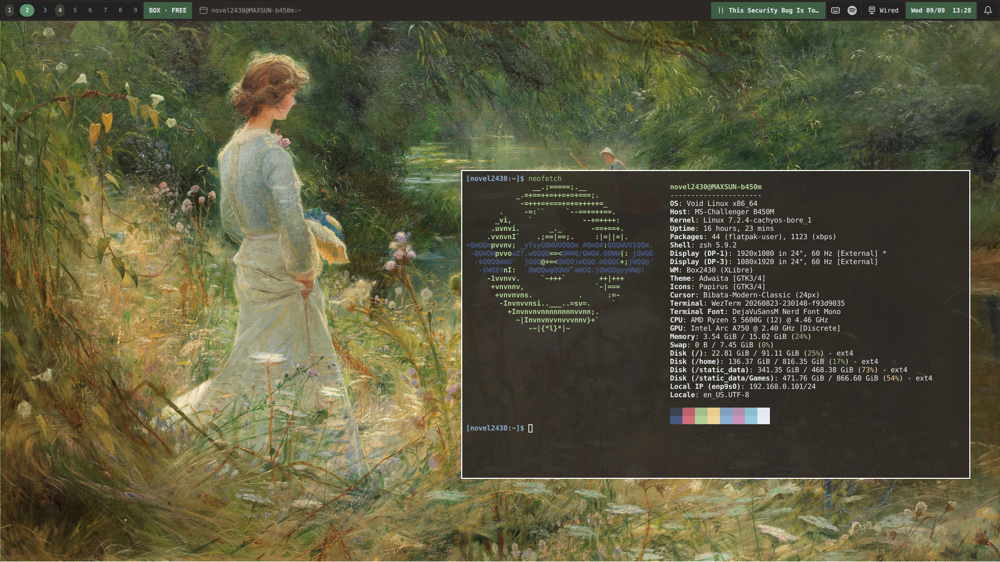
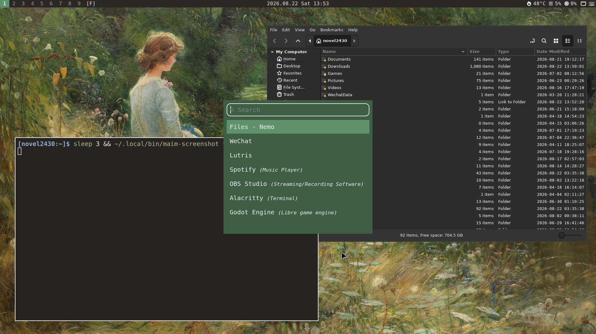
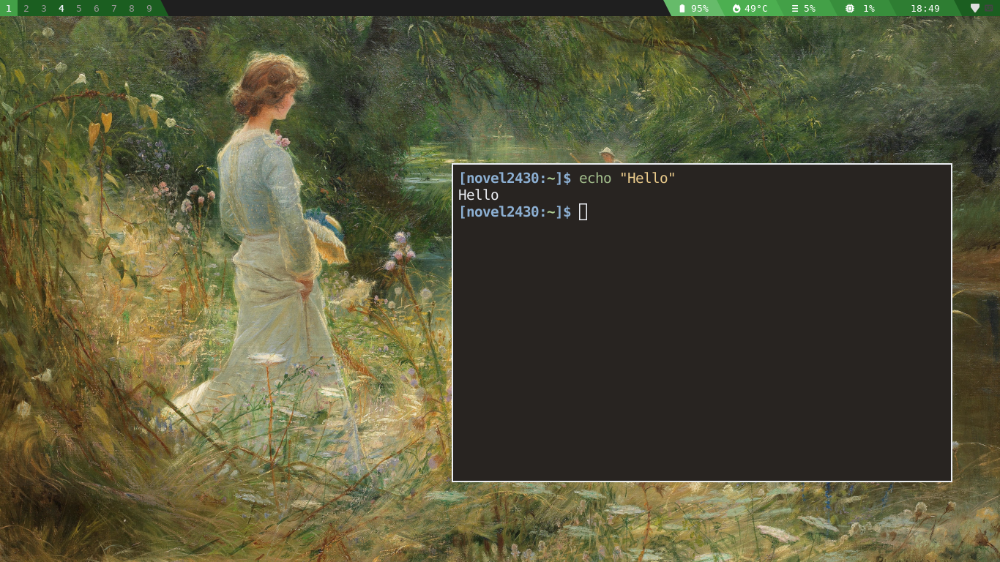
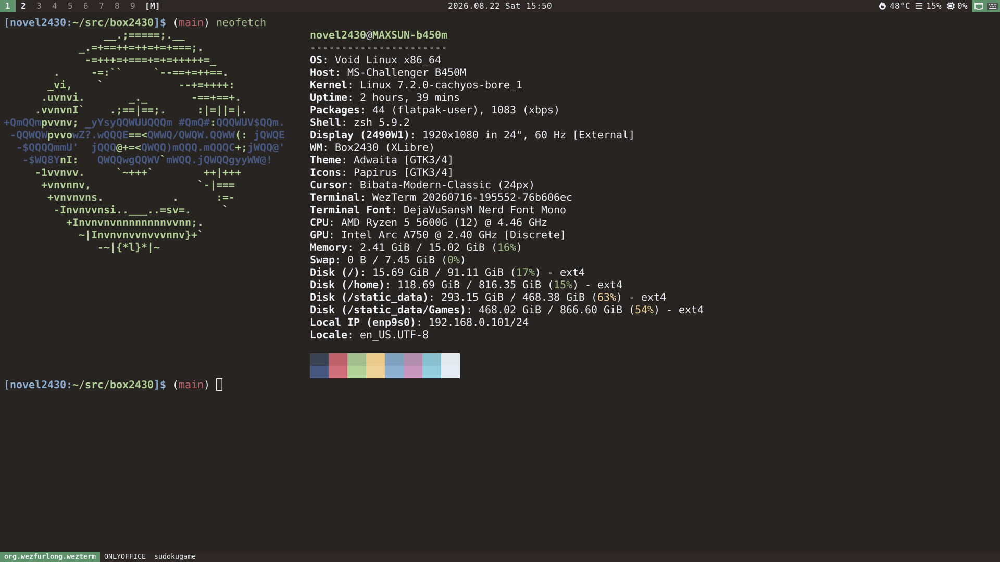

# Box2430

**A small stacking window manager with per-monitor workspaces.**

Box2430 is written in C and keeps a traditional, mouse-friendly stacking workflow while giving each monitor its own independent set of workspaces. The mature frontend is a non-reparenting X11/Xlib WM; the repository also contains an experimental river external-WM frontend that reuses the same backend-neutral Box core.

Every workspace can use one of two presentation modes:

* **FREE** — normal overlapping windows with moving, resizing, snapping, maximizing, and stacking.
* **MONOCLE** — one client fills the workarea, with an optional tab bar for switching between windows.

Box2430 also includes a lightweight native bar and tray, configurable window decorations, practical ICCCM/EWMH support, and an optional bspwm compatibility adapter that lets **Polybar's existing `internal/bspwm` module work directly with Box2430**.

<p align="center">
  
</p>

## Why Box2430?

Box2430 started from a simple gap in the desktop setup I wanted to use.

On X11, I wanted a lightweight **stacking** window manager where workspaces belong to monitors rather than to one global desktop set. Traditional stacking WMs such as Openbox do not use that workspace model.

On Wayland, Wayfire already gives me the kind of independent multi-output workflow I want. Box2430 is not an attempt to recreate Wayfire; it fills that particular workflow gap for my X11 systems.

The resulting model is intentionally simple:

```text
Monitor A:  [1] [2] [3] [4] ...
Monitor B:  [1] [2] [3] [4] ...
```

Changing the active workspace on one monitor does not mean changing the workspace on every monitor.

Inside each workspace, Box2430 remains stacking-first. There is no automatic tiling tree to manage. When a workspace needs a more focused layout, it can switch to MONOCLE instead.

## Screenshots

<table>
  <tr>
    <td align="center">
      <br>
      <b>Native UI</b>
    </td>
    <td align="center">
      <br>
      <b>Polybar</b>
    </td>
  </tr>
  <tr>
    <td align="center">
      <br>
      <b>MONOCLE</b>
    </td>
    <td align="center">
      <br>
      <b>With Quickshell</b>
    </td>
  </tr>
</table>

## Features

### Window management

* Traditional non-reparenting X11 stacking model
* Per-monitor workspaces
* Per-workspace **FREE** and **MONOCLE** modes
* Click-to-focus and sloppy-focus policies
* Stable client-order focus cycling
* Independent focus history and stacking order
* Edge and corner snapping
* Maximize and fullscreen
* Configurable FREE/MONOCLE borders
* Optional FREE-mode window decorations
* Rules for placement, monitor/workspace assignment, borders, decoration, focus, raise behavior, and fullscreen policy

### Multi-monitor

* RandR 1.5 logical-monitor discovery
* Independent workspace state for every monitor
* Runtime monitor topology reconciliation
* Monitor-aware snapping, bars, tabs, placement, and workspace interaction

### Native UI

Box2430 can provide the basic pieces needed for a usable desktop without requiring an external panel:

* Per-monitor bar
* Workspace indicator
* FREE / MONOCLE mode indicator
* Focused window title
* Root status text
* Clock
* XEmbed system tray
* MONOCLE tab bar
* Configurable top/bottom placement and widget layout

The native UI is optional. Box2430 is also intended to work well with external desktop components.

### Polybar compatibility

Box2430 has a small optional compatibility adapter for the subset of the bspwm IPC protocol used by Polybar's built-in `internal/bspwm` module.

That means **no custom Polybar workspace script or Box2430-specific Polybar module is required**.

Enable the adapter:

```toml
[bspwm_compat]
enabled = true
```

Then configure Polybar normally:

```ini
[module/workspaces]
type = internal/bspwm

pin-workspaces = true
enable-click = true
enable-scroll = true

format = <label-state>

label-focused = %name%
label-occupied = %name%
label-urgent = %name%!
label-empty = %name%
```

Polybar receives Box2430's per-monitor workspace state and can switch workspaces through its normal bspwm module interface.

If desired, the workspace mode can also be displayed:

```ini
format = <label-state> <label-mode>

label-monocle = MONOCLE
label-tiled = FREE
```

`FREE` is only mapped onto Polybar's existing `label-tiled` presentation slot; Box2430 does not acquire bspwm tiling semantics.

This compatibility layer is intentionally small. It does **not** provide general bspwm or `bspc` compatibility.

See [`docs/REFERENCE.md`](docs/REFERENCE.md#polybar-workspace-integration) for the full contract and socket behavior.

### X11 compatibility

Box2430 implements the ICCCM/EWMH behavior needed for normal desktop use, including:

* focus protocols
* active-window tracking
* client lists
* maximize and fullscreen state
* docks and struts
* special window types
* startup discovery of existing clients
* urgency
* normal size hints
* client-initiated fullscreen policy

## Build

Dependencies:

* C11 compiler such as GCC or Clang
* GNU Make
* `pkg-config`
* X11
* XRandR 1.5 or newer
* Xft
* Xcursor

Build a debug binary:

```sh
make
```

The binary is created at:

```text
build/debug/box2430
```

Build a release binary:

```sh
make release
```

Install it:

```sh
sudo make install
```

The installed executable is:

```text
box2430
```

## Quick start

Box2430 can run with built-in defaults, so a configuration file is not required for the first launch.

From `.xinitrc`:

```sh
exec box2430
```

Or specify a configuration explicitly:

```sh
exec box2430 -c ~/.config/box2430/config.toml
```

To start a session script after Box2430 initializes and discovers existing windows:

```sh
exec box2430 --autostart ~/.config/box2430/autostart.sh
```

The autostart file must be executable and provide its own shebang.

Without `-c`, Box2430 searches for:

```text
$XDG_CONFIG_HOME/box2430/config.toml
```

or:

```text
~/.config/box2430/config.toml
```

A complete example is available in [`config.example.toml`](config.example.toml).

Invalid configuration is rejected as a whole and Box2430 falls back to its built-in defaults.

## Default controls

The defaults are intended to make a fresh build immediately usable.

| Binding                                | Action                           |
| -------------------------------------- | -------------------------------- |
| `Super+Return`                         | Spawn `kitty`                    |
| `Super+q`                              | Close focused window             |
| `Super+1` … `Super+9`                  | Switch workspace                 |
| `Super+Shift+1` … `Super+Shift+9`      | Move focused window to workspace |
| `Alt+Tab`                              | Cycle windows                    |
| `Super+j` / `Super+k`                  | Focus next / previous client     |
| `Super+m`                              | Toggle FREE / MONOCLE            |
| `Super+Left` / `Super+Right`           | Snap left / right                |
| `Super+Up`                             | Toggle maximize                  |
| `Super+f`                              | Toggle fullscreen                |
| `Super+Ctrl+Left` / `Super+Ctrl+Right` | Select previous / next monitor   |
| `Super+Button1`                        | Move window                      |
| `Super+Button3`                        | Resize window                    |
| `Super+Shift+r`                        | Restart Box2430                  |
| `Super+Shift+e`                        | Exit Box2430                     |

Keyboard, client mouse, decoration, tab-bar, and workspace-bar bindings are configurable.

## Configuration

Box2430 uses TOML configuration.

Major configuration areas include:

```toml
[workspaces]
[bspwm_compat]
[focus]
[placement]
[fullscreen]

[appearance]
[appearance.border.free]
[appearance.border.monocle]
[appearance.decoration]
[appearance.bar]
[appearance.tabs]
[appearance.snap_preview]

[snap]

[bindings]
[bindings.keys]
[bindings.mouse]
[bindings.decoration]
[bindings.tabbar]
[bindings.workspacebar]

[[rules]]
```

Window decorations are optional and disabled by default. They are implemented as sibling windows rather than by reparenting clients, and are only shown in FREE mode.

For the complete configuration and command reference, see [`docs/REFERENCE.md`](docs/REFERENCE.md).

## Desktop integration

Box2430 deliberately does not try to be a complete desktop environment.

You can use the built-in UI, replace individual parts, or build a more complete shell around the WM.

Typical setups include:

```text
Box2430 + native bar/tray
Box2430 + Polybar
Box2430 + Quickshell
Box2430 + picom + external launcher / notification daemon
```

Wallpaper programs such as `feh` can own the root background normally. Box2430 only paints its configured fallback root color when starting a fresh WM session.

Cursor themes are loaded through Xcursor, so normal variables such as:

```sh
export XCURSOR_THEME="Bibata-Modern-Classic"
export XCURSOR_SIZE=24
```

work as expected.

## Design choices

Some behaviors are intentional rather than missing features.

### Workspaces belong to monitors

Box2430 does not model its workspaces as one global EWMH desktop set.

The monitor/workspace relationship is part of the WM's core model rather than a presentation trick layered on top.

### Stacking first

Box2430 does not have an automatic tiling tree.

FREE mode is a conventional overlapping desktop. MONOCLE provides a focused one-window-at-a-time alternative when desired.

### No minimize workflow

Box2430 intentionally has no minimize/iconify workflow. Workspaces and MONOCLE are the primary ways to organize windows that are not currently visible.

### The shell is replaceable

The native bar, tray, tabs, Polybar adapter, and external shell integrations sit around the same WM core.

Using Polybar or Quickshell should not require turning Box2430 into a different window manager.

### X11 stays first-class; Wayland is a separate frontend

Box2430 started on X11 because that is where the workflow it was created for was missing. The X11 frontend remains a first-class implementation rather than a compatibility layer.

The experimental Wayland path does not turn Box2430 into a compositor. It runs as an external window manager for river: river owns the compositor/rendering plumbing while Box2430 supplies workspace, focus, stacking, FREE/MONOCLE, tab, snap, maximize, fullscreen, rule, and binding policy through the shared core.

## Development

The repository includes regression coverage for the window-management behavior rather than relying only on manual desktop testing.

The test suite covers areas including:

* client lifecycle
* focus and urgency
* workspace transitions
* stacking
* fullscreen and maximize
* snapping and geometry
* decorations
* native bars and tabs
* XEmbed tray behavior
* RandR topology changes
* rules and configuration
* bspwm/Polybar compatibility
* restart and startup behavior

See [`DEVELOPMENT.md`](DEVELOPMENT.md) for build profiles, Xvfb/Xephyr testing, sanitizers, debugging, and real-session verification.

## Documentation

* [`docs/REFERENCE.md`](docs/REFERENCE.md) — commands, configuration, bindings, widgets, rules, and integration behavior
* [`docs/ARCHITECTURE.md`](docs/ARCHITECTURE.md) — runtime model, X11 behavior, and architectural invariants
* [`docs/IMPLEMENTATION_STYLE.md`](docs/IMPLEMENTATION_STYLE.md) — long-lived implementation principles
* [`DEVELOPMENT.md`](DEVELOPMENT.md) — testing, debugging, and development workflow

## Status

Box2430 is actively developed and used as a working window manager.

Behavior described by the checked-in implementation and regression tests should be treated as authoritative when documentation and code disagree.

## License

Box2430 is released under the GNU General Public License v2.0. See [`LICENSE`](LICENSE).
